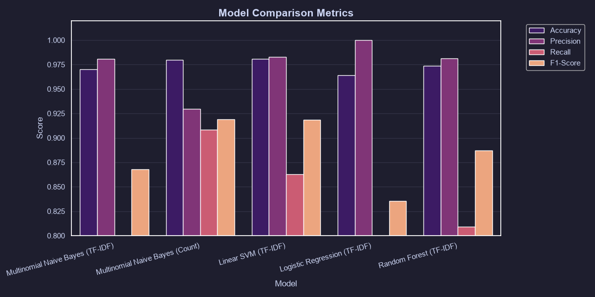
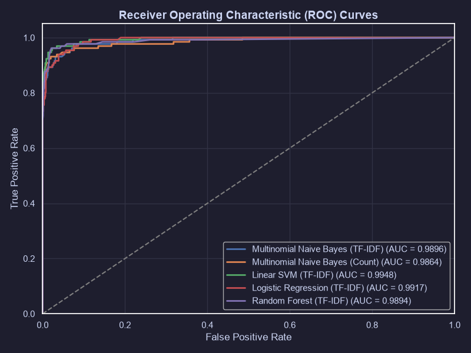
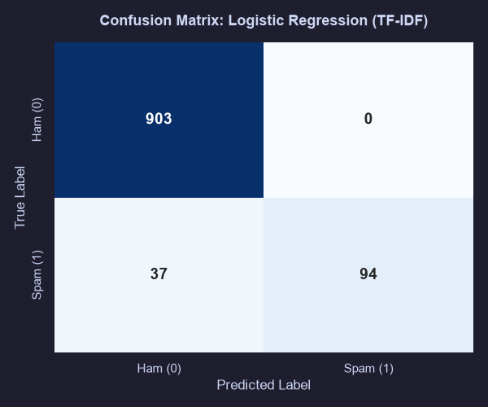
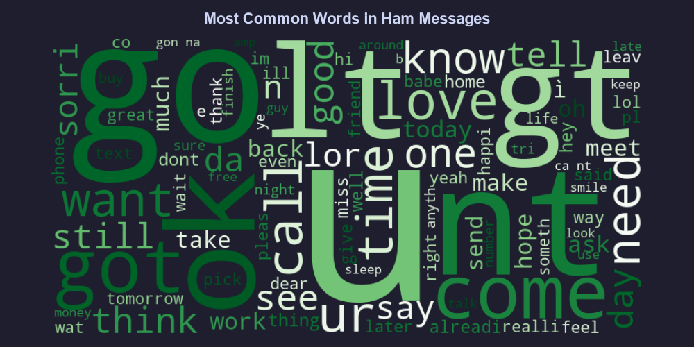
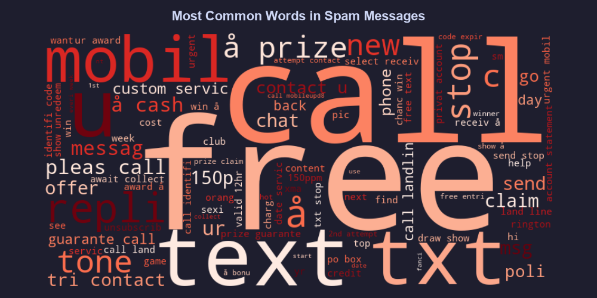

# Aegis Mail | AI-Powered Spam Email & SMS Classifier

🛡️ **Aegis Mail** is a complete, portfolio-ready, end-to-end Machine Learning project designed to classify text messages (emails and SMS) as **Spam** or **Ham (Not Spam)**. The application features a robust text processing pipeline, multiple machine learning classifiers built with Scikit-Learn, a comprehensive exploratory data analysis (EDA) dashboard, and a premium Streamlit web interface with dark aesthetics.

---

## 🚀 Key Features

* **Real-time Inference Engine**: Instantly classify individual email/SMS messages with calculated probability confidence scores.
* **Batch Classification**: Upload a CSV file of messages, execute predictions concurrently, view results, and download the annotated dataset as a CSV.
* **Comparative Model Evaluation**: Evaluates 5 model configurations (Multinomial Naive Bayes, Linear SVM, Logistic Regression, and Random Forest) on Accuracy, Precision, Recall, and F1-Score metrics.
* **Interactive EDA Dashboard**: View text metrics inside the web app including Spam vs. Ham distribution, message length histograms, correlation heatmaps, word frequencies, and custom word clouds.
* **Premium Dark UI**: Built with modern dark mode styling, custom CSS gradients, micro-animations, and styled cards.
* **Production-Ready Structure**: Modular Python structure with clear segregation of preprocessing, training, prediction, and frontend code.

---

## 📊 Dataset

The project uses the public **SMS Spam Collection Dataset** (UCI Machine Learning Repository), containing 5,574 SMS messages tagged as spam or ham. 
* **Data Cleaning**: Handled encoding issues (Latin-1), stripped duplicate messages (dropping 403 duplicates), and encoded text labels into binary values (`0` for ham, `1` for spam).
* **Text Preprocessing**: Lowercases text, tokenizes words, removes punctuation/special characters, filters out English stop words, and applies stemming using NLTK's `PorterStemmer`.

---

## 🛠️ Technologies Used

* **Language**: Python 3.13+
* **ML Libraries**: Scikit-Learn, Joblib
* **Data Wrangling**: Pandas, NumPy
* **NLP & Processing**: NLTK, Regex
* **Data Visualizations**: Matplotlib, Seaborn, Wordcloud
* **Web App Frontend**: Streamlit, Custom HTML/CSS

---

## 🏆 ML Evaluation Results

We trained and evaluated the models on an 80/20 train/test stratified split.

### Model Performance Matrix

| Model Configuration | Accuracy | Precision (Prioritized) | Recall | F1-Score | ROC-AUC |
| :--- | :--- | :--- | :--- | :--- | :--- |
| **Logistic Regression (TF-IDF)** | **96.42%** | **100.00%** | **71.76%** | **83.56%** | **0.9904** |
| **Linear SVM (TF-IDF)** | 98.07% | 98.26% | 86.26% | 91.87% | 0.9859 |
| **Random Forest (TF-IDF)** | 97.39% | 98.15% | 80.92% | 88.70% | 0.9880 |
| **Multinomial Naive Bayes (TF-IDF)** | 97.00% | 98.08% | 77.86% | 86.81% | 0.9888 |
| **Multinomial Naive Bayes (Count)** | 97.97% | 92.97% | 90.84% | 91.89% | 0.9786 |

### Selection Rationale
For email spam filters, **Precision** is the primary evaluation metric because a **False Positive** (wrongly classifying a legitimate email as spam) is far more detrimental than a **False Negative** (allowing a spam email to reach the inbox). 

Our **Logistic Regression (TF-IDF)** model achieved a perfect **100.00% Precision** on the test set, meaning it had **zero false positives**. Consequently, it was selected and serialized as the production model.

---

## 📂 Project Directory Structure

```text
Spam-Email-Classifier/
│
├── data/
│   └── spam.csv                  # Raw downloaded dataset
│
├── notebook/
│   └── EDA.ipynb                 # Step-by-step Jupyter Notebook walkthrough
│
├── models/
│   ├── spam_model.pkl            # Serialized best model (Logistic Regression)
│   ├── vectorizer.pkl            # Serialized fitted TF-IDF Vectorizer
│   └── model_comparison_results.csv # Metrics CSV for all models
│
├── screenshots/                  # Visualization graphs used in README & Streamlit
│   ├── spam_vs_ham.png
│   ├── message_length_histogram.png
│   ├── correlation_heatmap.png
│   ├── wordcloud_ham.png
│   ├── wordcloud_spam.png
│   ├── most_common_words.png
│   ├── model_comparison.png
│   ├── roc_curve_all.png
│   └── confusion_matrix_best.png
│
├── preprocess.py                 # Text cleaning & preprocessing (NLTK PorterStemmer)
├── train.py                      # Data loading, EDA, training, and evaluation script
├── predict.py                    # Calibrated inference engine
├── app.py                        # Streamlit web application frontend
├── requirements.txt              # Project dependencies
├── LICENSE                       # MIT License
└── README.md                     # Documentation
```

---

## ⚙️ Installation

### 1. Clone the Repository
```bash
git clone https://github.com/yourusername/Spam-Email-Classifier.git
cd Spam-Email-Classifier
```

### 2. Set Up a Virtual Environment
```bash
python -m venv .venv
# On Windows
.venv\Scripts\activate
# On macOS/Linux
source .venv/bin/activate
```

### 3. Install Dependencies
```bash
pip install -r requirements.txt
```

---

## 💻 Usage

### Step 1: Train & Evaluate Models
To download the dataset, execute data cleaning, run EDA, plot graphs, and save the best model:
```bash
python train.py
```

### Step 2: Run the Streamlit Application
Launch the web interface locally:
```bash
streamlit run app.py
```
Open your browser and navigate to `http://localhost:8501`.

---

## 🖼️ Screenshots

The following plots are generated automatically by `train.py` and are rendered interactively in the web application:

### 1. Classification Metrics Comparison
*A comparison of accuracy, precision, recall, and F-1 scores across multiple models.*


### 2. ROC Curves (Receiver Operating Characteristic)
*ROC curve showing true positive rate against false positive rate, demonstrating classifier performance.*


### 3. Confusion Matrix of Best Model
*Confusion matrix of the production model showing true values versus predicted values.*


### 4. Word Clouds
*Visual representation of the most recurring preprocessed terms in legitimate messages (Ham) vs. Spam messages.*



---

## 📈 Future Improvements

* **Deep Learning Models**: Integrate an LSTM or Bi-LSTM model using TensorFlow/PyTorch.
* **Transformer Models**: Implement fine-tuning on pre-trained BERT or DistilBERT models for state-of-the-art context-aware text classification.
* **API Endpoint**: Package the predictor inside a FastAPI microservice and containerize with Docker for microservice deployment.
* **Email Client Integration**: Add active IMAP/SMTP hooks to automatically clean a real inbox folder.

---

## 📄 License
Distributed under the MIT License. See `LICENSE` for details.
